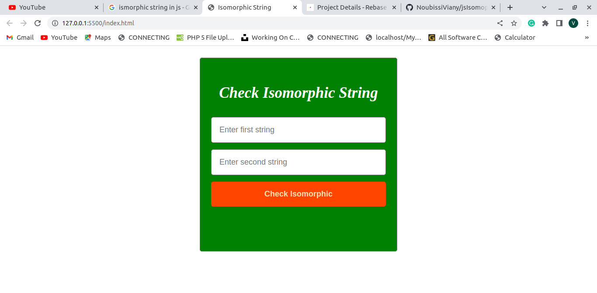

# JS Isomorphic Strings

this project is all about an app that checks ​two strings s and t, to determine if they are isomorphic. Two strings are isomorphic if the characters in s can be replaced to get t.

## App

### Built With

- HTML
- CSS
- JS

### Prerequisites

Knowledge about:

- HTML
- CSS
- Google chrome
- JS

## Clone project

- To get a local copy up and running follow these simple example steps.
- Clone this repository with `git@github.com:NoubissiViany/jsIsomorphicStrings.git` using your terminal.
- Change to the project directory by entering: cd jsIsomorphicString the terminal.

## steps

- $ git clone `git@github.com:NoubissiViany/jsIsomorphicStrings.git`
- $ `cd jsIsomorphicString`
- $ `git checkout feature/Isomorphic-String`

## Start App

- run by opening the index.html in the browser

## Author

👤 **NoubissiViany**

- GitHub: [@NoubissiViany](git@github.com:NoubissiViany/jsIsomorphicStrings.git)

## 📝 License

This project is [Rebase Academy](./LICENSE) licensed.
